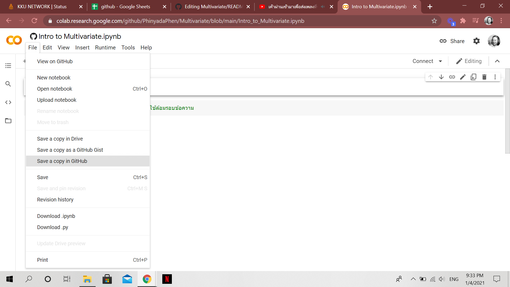
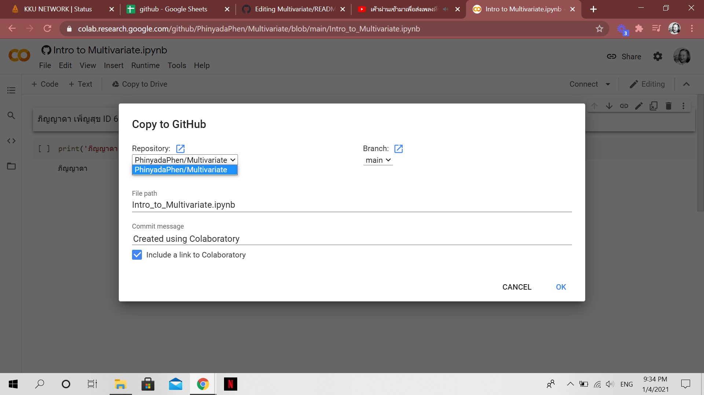
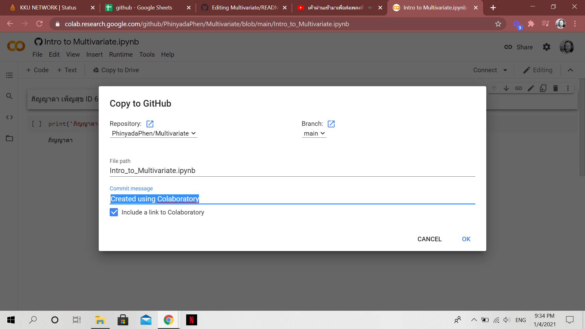
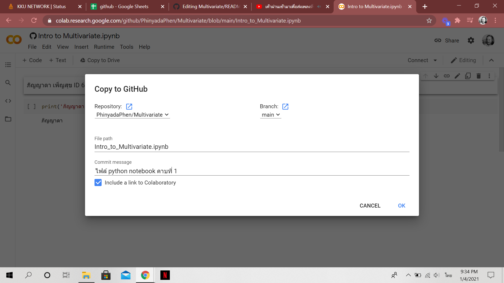

# Multivariate

### ภิญญาดา ID 623021052-2

.md => Markdown
[ ] square brackets

( ) parentheses

อธิบายการใช้งาน Github และ Google Colab ว่าหน้าที่ของแต่ละอันคืออะไร และอธิบายวิธีเซฟไฟล์จาก Google Colab ลงใน Github

หน้าที่ของ Github คือ เป็นระบบที่มีหน้าที่ในการจัดเก็บการเปลี่ยนแปลงของไฟล์ในโปรเจ็คเรา มีการ backup code ให้เรา สามารถที่จะเรียกดูหรือย้อนกลับไปดูเวอร์ชั่นต่างๆของโปรเจ็คที่ใด เวลาใดก็ได้ หรือแม้แต่ดูว่าไฟล์นั้นๆใครเป็นคนเพิ่มหรือแก้ไข หรือว่าจะดูว่าไฟล์นั้นๆถูกเขียนโดยใครบ้างก็สามารถทำได้และสามารถเข้าถึงข้อมูลและจัดการไปผ่าน web โดยไม่ต้องเสียเงิน

 การใช้งาน Github  1. สมัครและสร้างบัญชีใน [Github](https://github.com/) 
                  2. เมื่อสร้างบัญชีสำเร็จ ทำการ sign in จากนั้น Start a Project
                  3. ใส่ Repository name / Description / Initialize this repository with
                  4. หลังจากนี้ก็สามารถใช้งาน Github ได้ตามสะดวก พร้อมคู่มือช่วยในการใช้งาน Github [Markdown Cheatsheet](https://github.com/adam-p/markdown-here/wiki/Markdown-Cheatsheet#links)

หน้าที่ของ Google Colab คือ เป็นโปรเจ็คที่พัฒนาโดยทีม Google Research ที่เปิดให้นักศึกษาและคนทั่วไปที่อยากเริ่มเขียนโค้ด Python ใช้งานได้ฟรีผ่าน Google Chrome Browser
 
 การใช้งาน Google Colab นั้นแสนง่ายเพราะมีเพียง Code cell และ Text cell
                   Code cell -> ใช้ในการเขียนโค้ด Python พอเขียนเสร็จ สามารถกดปุ่ม shortcut ในคีย์บอร์ด SHIFT + Enter เพื่อรันโค้ดใน Cell นั้นๆ
                   Text cell -> ใช้ text cell เพื่อจดโน้ตต่างๆ หรือใช้เขียนอธิบายโค้ดของเราให้คนอื่นที่มาอ่านโค้ดจะได้เข้าใจง่ายๆ กด SHIFT + ENTER รันโค้ดใน cell ถัดไป

วิธีเซฟไฟล์จาก Google Colab ลงใน Github
   1. ไปที่ File จากนั้นเลือก Save a copy in Github

   2. ค้นหา Project ที่ต้องการบันทึกที่ช่อง Repository

   
   3. สามารถใส่ข้อความได้ในช่อง Commit message

   4. กด OK เพื่อบันทึก

